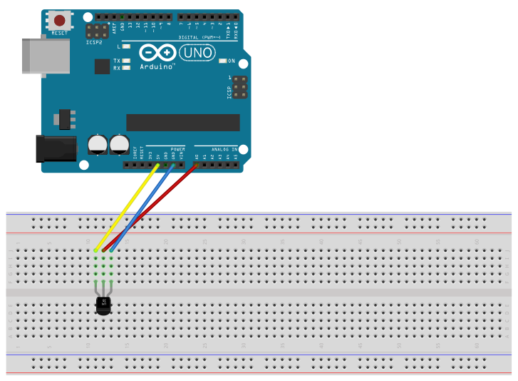

# Temperature (LM35)

## Components 
### Temperature (LM35)

* LM35 sensor detects the temperature with a calibrated precision of 1ºC.
* Its measuring range extends from -55 °C to 150 °C. The output is linear and each degree Celsius is equivalent to 10 mV.

## Diagram

Here´s the following example of a LM35 sensor that just outputs the measured temperature in the serial monitor.

## Example

Here´s the following example with a LM35 sensor. The code just prints the measured temperature in the serial monitor.

#### Demo

#### Code

* **analogRead(PIN);** gets the analog value from the pin with name *PIN*.
* **value / 1024.0 * 5000 / 10** is the formula to compute the celsius degrees from value given in millivolts.

You can find the code [here](./Temperature.ino).
