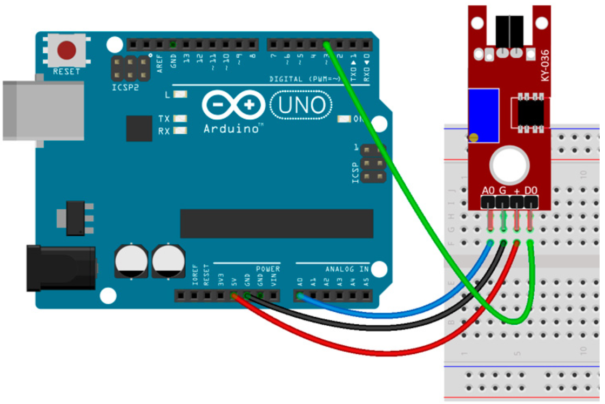

# Touch (Metallic)

## Components 
### Touch (Metallic)

* The ON/OFF switch, also called the toggle switch, has two state ON/OFF.
* The rocker switch changes his status as soon as it is pressed.

## Diagram

Here´s the following example of a Touch sensor.

## Example

Here´s the following example with a Touch sensor. It just turns on/off the builtin LED when touching the sensor.

#### Demo

#### Code

You can find the code [here](./Touch.ino).
