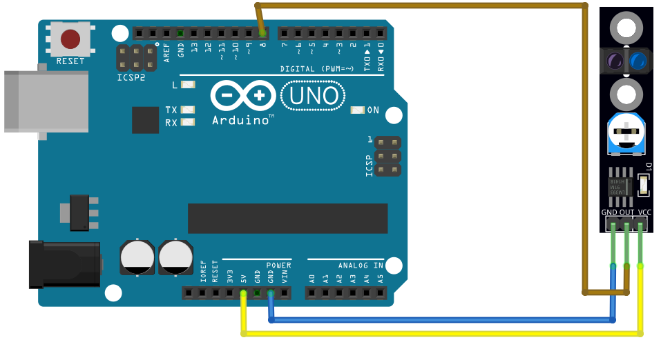
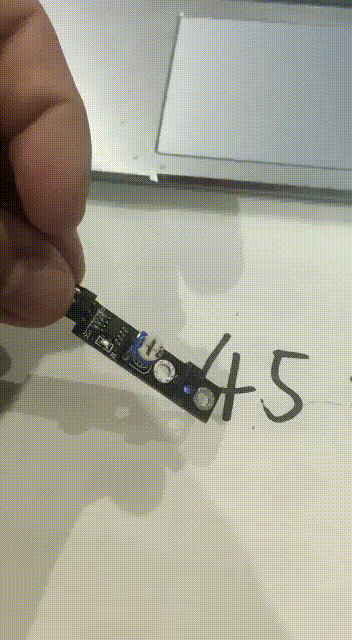

# Tracking

## Components 
### Tracking

* KY-033 Line tracking sensor is a line tracking sensor and it does exactly what the name suggests it tracks black lines against white background or white lines against black background whatever you would like to do and it’s a pretty simple device. 
* This is basically obstacle sensing module having built-in receiver and transmitter that senses the IR energy and looks for the reflected IR energy to detect the obstacle in front of the sensor module. 
* The sensor returns the status of the IR light reflected from the surface.
* When this line tracking sensor is on a black surface then all of the radiation that’s been transmitted gets absorbed by the surface and nothing is reflected onto the sensor and so we get a zero output signal and when it is on a white surface the opposite happens all of the radiation that is transmitted off the transmitter is being detected by the receiver and then we get a positive signal or a digital one.

## Diagram

Here´s the following example of a Tracking sensor.

## Example

Here´s the following example with a Tracking sensor. It just prints on the serial monitor the state of the sensor.

#### Demo

#### Code

You can find the code [here](./Tracking.ino).
