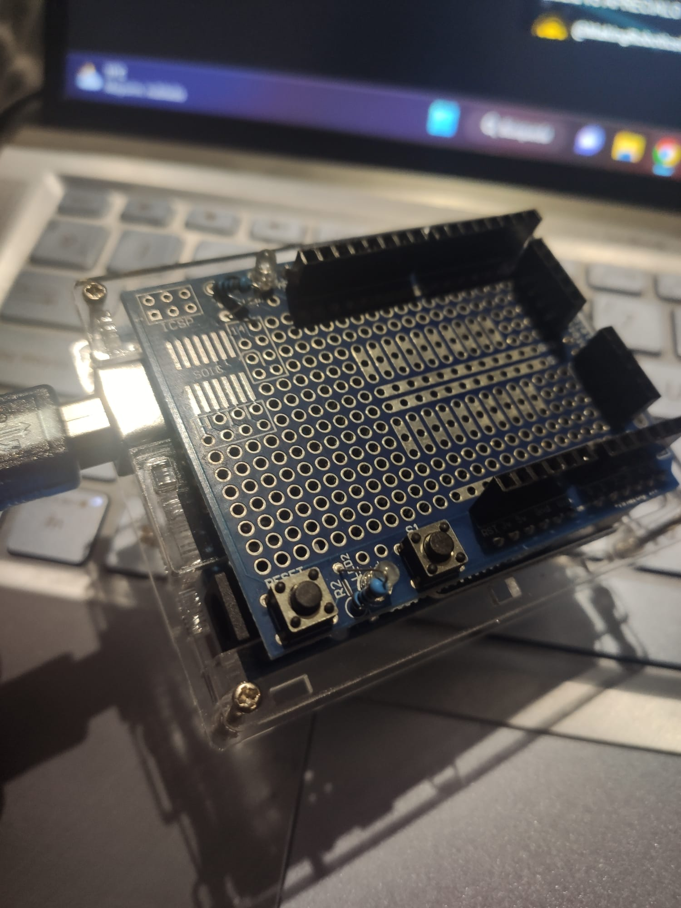

# Prototype Shield

## Components 
### Prototype Shield

* A prototype shield is an Arduino extension that allows makers to have more space to develop their designs by giving a higher number of pins, rails, buttons or other features.
* This is a design for an open-source prototyping shield for Arduino NG/Diecimila. It has tons of cool features, to make prototyping on your Arduino easy:
    * Compatible with NG or Diecimila
    * Reset button up top
    * ICSP header
    * Lots of GND and +5V rails
    * DIP prototyping area makes it easy to add more chips
    * SOIC prototyping area above USB jack for up to 14-pin SOIC chip, narrow medium or wide package.
    * Use 'mini' or 'medium' breadboard
    * Two 3mm LEDs with matching resistors
    * Extra 6mm button

## Design

Here you can see the shield with a mini breadboard on it:

Here you can see the shield without any breadboard, just the shield itself:

From front you can see the LEDs with their resistors and reset and new button availables:

From back you can see all the new rails:

