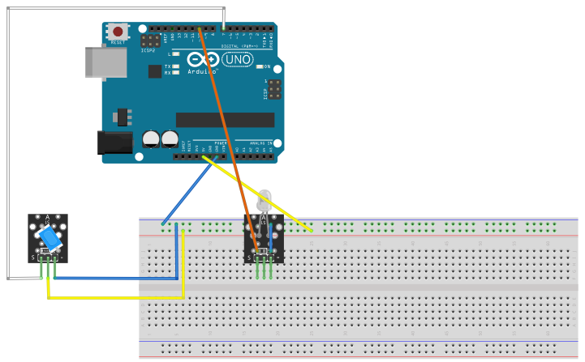

# Ball Switch

## Components 
### Ball Switch

* A ball tilt sensor is more of a switch that can detect basic motion, orientation or inclination.
* These switches are designed in such a way that a sufficient level of inclination makes or breaks the electrical connection. Such a signal can either be used as an indicator or can be used to turn something ON or OFF.

## Diagram

Here´s the following example of a Ball Switch.

## Example

Here´s the following example with a Ball Switch. It just turns a LED on when the switch is on by moving it.

#### Demo

#### Code

You can find the code [here](./Ball_Switch.ino).
