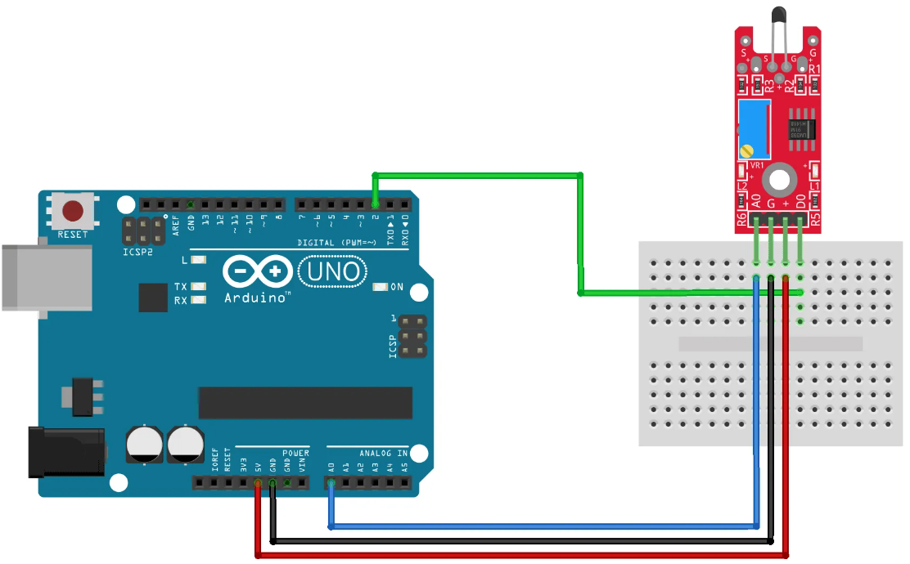

# Digital Temperature

## Components 
### Digital Temperature

* The KY-028 Digital Temperature Sensor measures temperature changes based on thermistor resistance. This module has both digital and analog outputs, there’s a potentiometer to adjust the detection threshold on the digital interface.
* This module consists of an NTC thermistor, an LM393 dual differential comparator, a 3296W trimmer potentiometer, 6 resistors, 2 LEDs, and 4 male header pins. The module features analog and digital outputs.

## Diagram

Here´s the following example of a Digital Temperature sensor.

## Example

Here´s the following example with an DigitalTemperature sensor. It measures the ambient temperature and turns led on if threshold is reached.

#### Demo

#### Code

You can find the code [here](./Digital_Temperature.ino).
