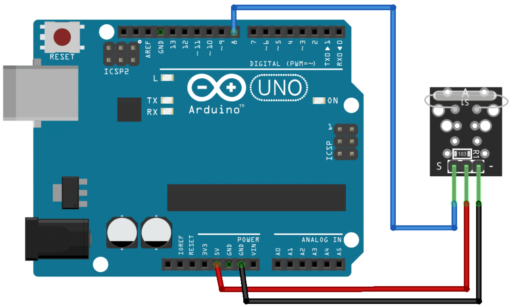

# Reed Switch

## Components 
### Reed Switch

* A reed switch is a type of switch that turns on and off when there is a strong magnetic field nearby.
* There are two main types of Reed switchs which are KY-021 that only inputs a digital signal and the KY-025 which has a potentiometer and detects a digital and analog signal.

## Diagram

Here´s the following example of a Reed Switch.

## Example

Here´s the following example with a Reed Switch. It just turns on the builtin LED when a magnetic field is detected.

#### Demo

#### Code

You can find the code [here](./Reed.ino).
