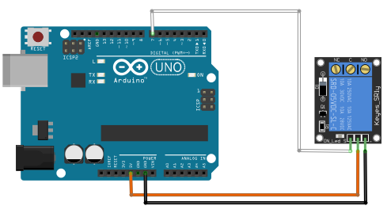
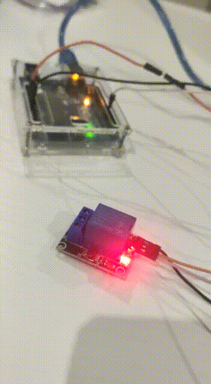

# Relay 5V

## Components 
### Relay 5V

* A relay is a switch, most often electromagnetic, that uses a small current to drive a larger circuit. Basically, a signal is applied at the input which turns on another circuit connected at the output, without the need for human supervision.
* Relays operate on the principle of electromagnetic induction, which implies that if current is passed through a coil that is wound around a piece of metal, then a magnetic field will be produced by the current, turning the metal core into an electromagnet.

## Diagram

Here´s the following example of a Relay of 5V.

## Example

Here´s the following example with a Relay 5V. The code just turns on and off the relay.

#### Demo

#### Code

* **pinMode(PIN, OUTPUT);** sets the pin with number *PIN* as an output signal to turn on the LED.
* **digitalWrite(PIN, VALUE);** writes a digital value (HIGH=1 or LOW=0) on the pin with number *PIN*. *HIGH* turns on the pin and *LOW* turns off.

You can find the code [here](./Relay_5V.ino).
