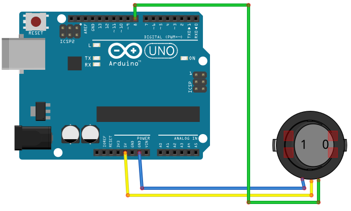

# Rocker

## Components 
### Rocker

* The ON/OFF switch, also called the toggle switch, has two state ON/OFF.
* The rocker switch changes his status as soon as it is pressed.

## Diagram

Here´s the following example of a Rocker switch.

## Example

Here´s the following example with a Rocker switch. It just turns on/off the builtin LED with input of rocker.

#### Demo

#### Code

You can find the code [here](./Rocker.ino).
