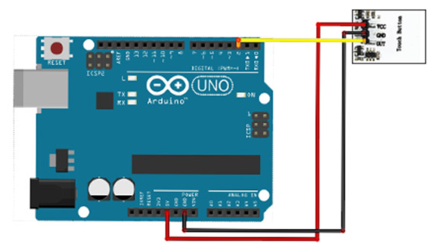

# Touch Switch

## Components 
### Touch Switch

* This touch module is available in different series with a variety of backlight colors. It features low price, high efficiency and long lifespan. The sensor part can also be placed on glass and thin plastic.
* Its output is on trigger mode which works like a switch. That is, when it is touched, its will be HIGH and remains HIGH until the next touch.

## Diagram

Here´s the following example of a Touch Switch.

## Example

Here´s the following example with a Touch Switch. It turns on and off the builtin LED by touching the switch.

#### Demo

#### Code

You can find the code from [here](./Touch_Switch.ino).
