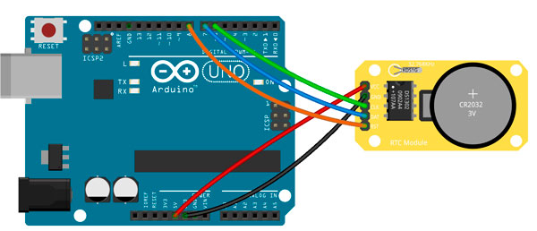

# Real Time Clock DS1302

## Components 
### Real Time Clock DS1302

* The DS1302 RTC clock module allows setting the date and time, contains a real-time clock-calendar with 31 bytes of static RAM. The clock module provides information on seconds, minutes, days, weeks, months and years. 
* The number of days in each month is automatically adjusted, there is also a leap year compensation function. It includes a battery cell with which you can keep the date updated.
* You should set once the datetime and after that comment the set command line, to avoid overriding actual time.

## Diagram

Here´s the following example of a Real Time Clock DS1302.

## Example

Here´s the following example with a Real Time Clock DS1302. It sets the time and prints it on the serial monitor second by second.

#### Demo

#### Code

You can find the code [here](./Real_Time_Clock_DS1302.ino).
