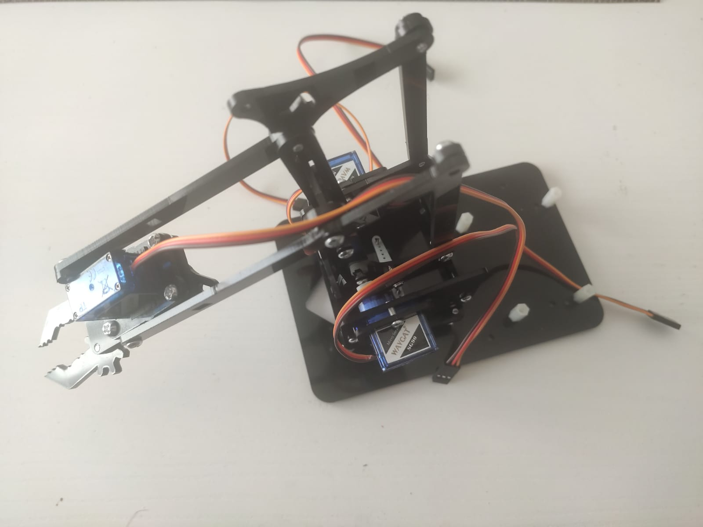
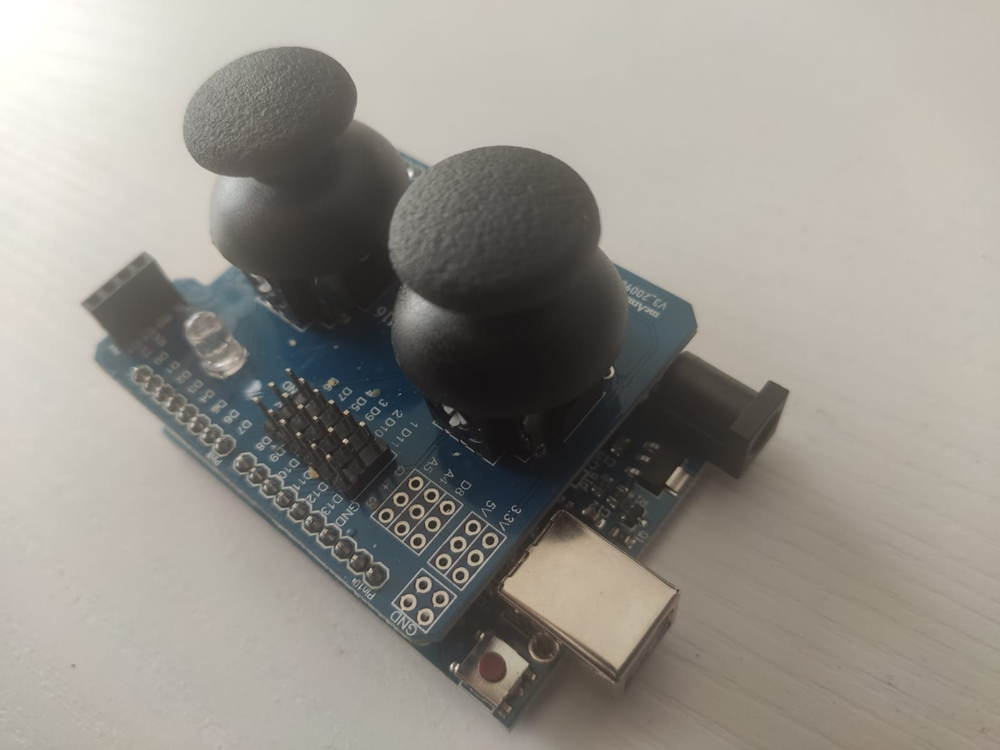

# MeArm

## Components 

* **MeArm** skeleton: There are thousands of e-shops where you could buy one. I bought a cheap one on [AliExpress](https://aliexpi.com/ghY3), but if it´s affordable I would suggest a higher quality one.
* 4 [Servos](../../Components/Motors/Servo) to move the 4 degrees of freedom of the arm (included in previous pack).
* 2 [Analog Joysticks](../../Components/Buttons/Analog%20Joystick) control the movement of the 4 degrees of freedom of the arm (HU-M16 shield included in pack).
* **Arduino** (included in pack).

## Assembly

I´ve followed the steps detailed in [ted99tw MeArm tutorial](https://www.instructables.com/meArmJoystick-DIY/) on instructables.com

After following all the steps above, you should have something like:

Due to the cheap materials, mine is not so good looking, but stills works and you can see here my result:

## Diagram

Once all the skeleton has been assembled, we proceed with the wiring to control all the structure with the joysticks as controllers and servos as motors. I´ve used a [HU-M16 Double Joystick Shield](https://aliexpi.com/fnpe) to ease all the wiring, by just assembling the shield with the arduino and then wiring all the different servos to the corresponding triple of pins (one per digital input):

Now we use this diagram to connect the wires to each triple pin:

## Code

To control the whole structure, I found this sketch from [ted99tw](https://www.instructables.com/meArmJoystick-en/) which I really like and uses the diagram from above (same author). It just controls the different servos making use of the analog inputs from the joysticks independently.

You can find the code [here](./MeArm.ino).

## Demo

As I´ve mentioned earlier, the quality of the skeleton wasn´t really good, so it has led to a rough structure that moves with some difficulty.

Even it works, I find more useful for a demo this one uploaded by [Leopoldo Armesto](https://www.youtube.com/watch?v=90KKBzwhgdY&ab_channel=LeopoldoArmesto) on his youtube channel, picking up an object and moving it.

